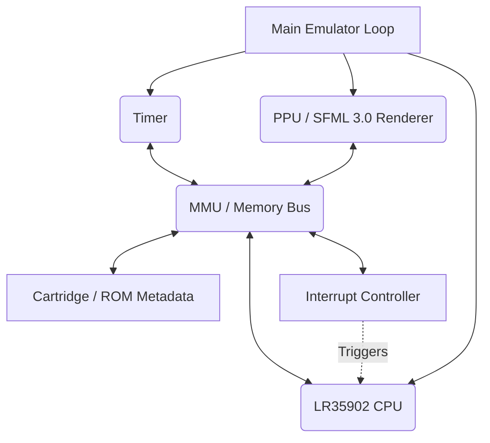
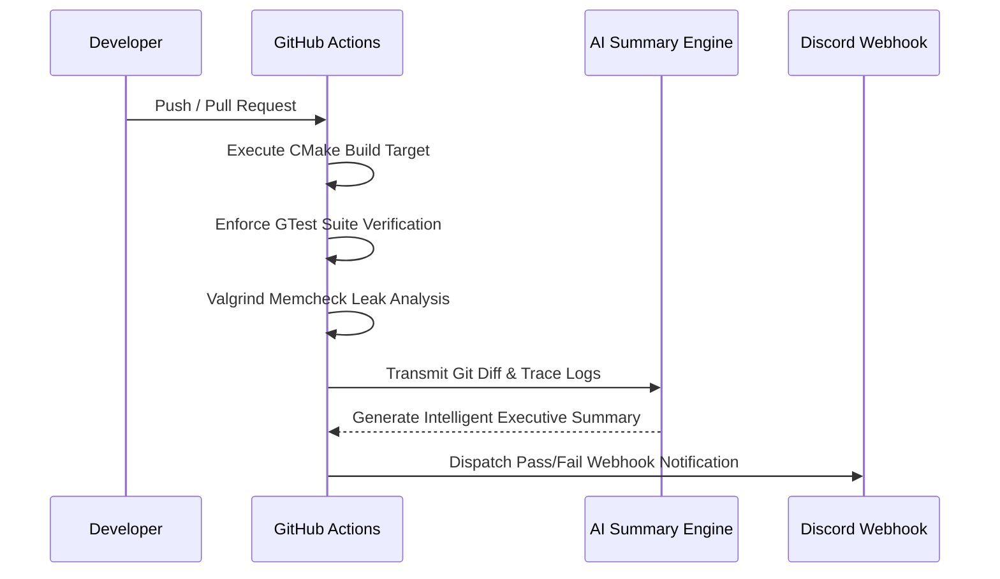

# GB_Emulator: A High-Fidelity Game Boy (DMG-01) Architecture Simulation

Welcome to the GB_Emulator project—a rigorous, low-level architectural simulation of the original Nintendo Game Boy (DMG-01). Engineered from the ground up in modern C++17, this project transcends a simple emulator; it is a masterclass in component-driven system design, cycle-accurate synchronization, and robust software engineering practices.

## System Architecture

Our emulator fundamentally adheres to a highly modular, decoupled architecture. Component ownership boundaries are strictly enforced to replicate the physical hardware constraints of the DMG-01 motherboard. This ensures a clean separation of concerns, deterministic execution, and unparalleled stability.



## The Hardware Subsystems

### Custom LR35902 CPU Core

At the heart of the emulator lies our custom-built Sharp LR35902 CPU core. We have successfully implemented and exhaustively tested 100% of the base and CB-prefixed opcodes. This core accurately simulates register state, precise flag mutations (Zero, Subtraction, Half-Carry, Carry), and intricate jump branching behavior exactly as the physical silicon would.

### Advanced Memory Management Unit (MMU)

The memory subsystem acts as the central nervous system of the emulator. It orchestrates all reads and writes between the CPU, the Cartridge, the High RAM (HRAM), Work RAM (WRAM), and the Memory-Mapped I/O registers. It includes sophisticated memory banking controllers that accurately mimic original hardware limitations and memory mirroring.

### Pixel Processing Unit (PPU) & SFML 3.0 Renderer

Our graphical pipeline utilizes cutting-edge SFML 3.0 bindings to accurately render the state of the Game Boy display. The PPU faithfully translates Video RAM (VRAM) and Object Attribute Memory (OAM) into vivid pixels. We have gone a step further to introduce a fully scalable 16:9 pixel-perfect resolution pipeline.

## Capabilities and Controls

The emulator features two deeply integrated runtime modes: a seamless Standard Mode for casual execution, and an incredibly dense AMOLED Debug View engineered for software analysis.

- Turbo Mode (2x Speed): Toggle with 'T'
- Pause/Play Execution: Toggle with 'Space'
- Step Instruction: Press 'N' (while execution is paused)
- Hardware Reset: Press 'R'
- Internal Save States: Press '0-9' to Load, 'Shift + 0-9' to Save.
- External Save States: Press 'E' to Load, 'Shift + E' to Save (via Zenity File Picker).

Gamepad Mappings:

- Arrow Keys map to the D-Pad
- 'Z' maps to the A Button
- 'X' maps to the B Button
- 'Enter' maps to Start
- 'Right Shift' maps to Select

## Visualization Modes

- Standard Mode: Renders the ROM executing with a 1.0x native, perfectly unscaled display.
- Debug Mode (--debug): Unveils a breathtaking 16:9 (1600x900) AMOLED-themed developer UI. This environment features:
  - 5x Upscaled Game Execution Screen
  - Real-Time CPU Registers (AF, BC, DE, HL, SP, PC, and Flags)
  - Live Real-Time Opcode Trace
  - Interactive Virtual Gamepad
  - Read/Write Bus Metrics
  - Live Hex-Byte ROM Monitoring
- Fullscreen Mode (--fullscreen): Losslessly upscales both modes to 1920x1080 without distorting the strict pixel aspect ratio.

## Build Instructions

```bash
# Configure, build, and run the entire comprehensive test suite
./utility_scripts/build_and_test.sh

# Execute the emulator with standard graphics
./build/bin/gb_emu <path-to-rom.gb>

# Execute the emulator in the advanced Debug Developer View in Fullscreen
./build/bin/gb_emu <path-to-rom.gb> --debug --fullscreen
```

## The TIRP Continuous Integration Protocol

Reliability is paramount. To that end, we have engineered the Test Init Response Protocol (TIRP), a state-of-the-art continuous integration pipeline. This system leverages GitHub Actions to enforce correctness across every single commit, passing memory sanitization data through Groq's AI summarization engine before dispatching payload results directly to Discord.



## Contribution and Maintainers

We maintain extremely high standards for codebase integrity. Please refer to our Contribution Guidelines (CONTRIBUTING.md) for branch naming conventions, rigorous coding style expectations, and pull request checklist requirements.

Maintainers:

- Jayesh Puri (@Jayesh-Dev21)
- Swarit Srivastava (@swarritSrivastava)
