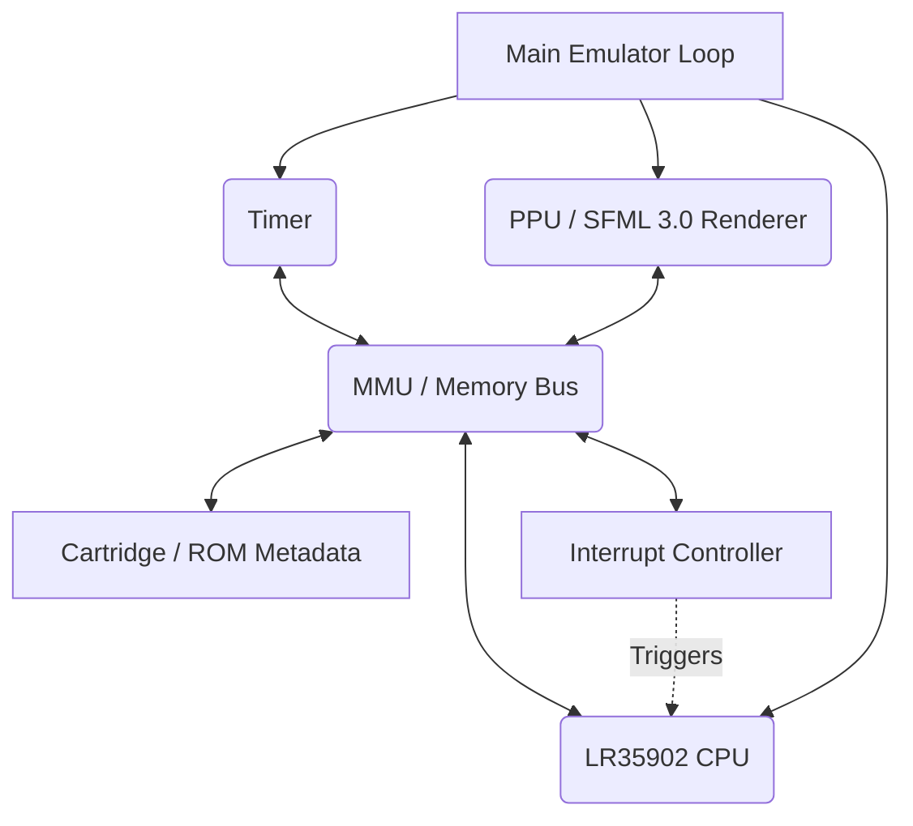
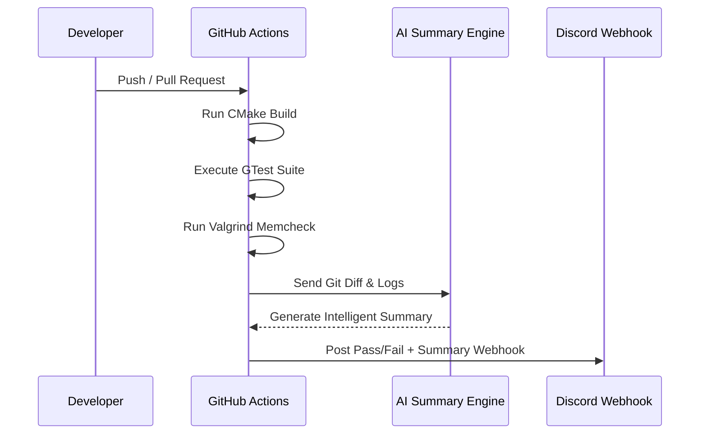

# GB_Emulator

A robust and accurate Game Boy (DMG-01) emulator featuring a fully-fledged LR35902 CPU core, high-performance SFML 3.0 renderer, integrated Debug AMOLED UI, and an advanced automated Testing/CI pipeline.

## 📐 Architecture Overview

The emulator follows a highly modular design built entirely in C++17, emphasizing tight component ownership and clear memory bus segregation.



## 🎮 Features & Controls

The emulator uses SFML 3.0 to render a robust UI in both standard mode and an advanced AMOLED Debug View. Both modes fully support the following features:

- **Turbo Mode (2x Speed)**: Toggle with `T`
- **Pause/Play**: Toggle with `Space`
- **Step Instruction**: Press `N` (while paused)
- **Hard Reset**: Press `R`
- **Save/Load States (Internal Slots)**: Press `0-9` to Load, `Shift + 0-9` to Save.
- **Save/Load States (External File)**: Press `E` to Load, `Shift + E` to Save (via Zenity File Picker).
- **Gamepad Control**: 
  - `Arrow Keys` for D-Pad
  - `Z` for A
  - `X` for B
  - `Enter` for Start
  - `Right Shift` for Select

*Note: In Normal mode, system hotkey triggers will display a temporary bright-red confirmation overlay.*

## 🖥️ Display Modes

- **Standard Mode**: Plays the ROM with a 1.0x native display.
- **Debug Mode (`--debug`)**: Opens a stunning 16:9 (1600x900) AMOLED-themed developer UI featuring:
  - 5x Upscaled Game Screen
  - Live CPU Registers (AF, BC, DE, HL, SP, PC, and Flags)
  - Real-time Opcode Trace
  - Clickable virtual gamepad
  - Memory Read/Write metrics
  - Live ROM hex-byte monitoring
- **Fullscreen (`--fullscreen`)**: Upscales both Normal and Debug modes to 1920x1080 without distorting the pixel aspect ratio.

## 🚀 Build and Run

```bash
# Configure + build + run all tests
./utility_scripts/build_and_test.sh

# Run emulator with standard graphics
./build/bin/gb_emu <path-to-rom.gb>

# Run emulator in Debug Developer View with Fullscreen
./build/bin/gb_emu <path-to-rom.gb> --debug --fullscreen
```

## 🔄 Workflow and TIRP Protocol

The project actively runs a highly automated **TIRP CI Workflow** mapped to Discord webhooks and GitHub Actions. All details regarding our cloud architecture can be found in `pipline/SetUp.md` and the generated Doxygen files.



## 🤝 Contributing & Maintainers

See our [Contribution Guidelines](CONTRIBUTING.md) for branch naming rules, coding style, and PR requirements.

**Maintainers:**
- Jayesh Puri (@Jayesh-Dev21)
- Swarit Srivastava (@Swarit,srivastava)
