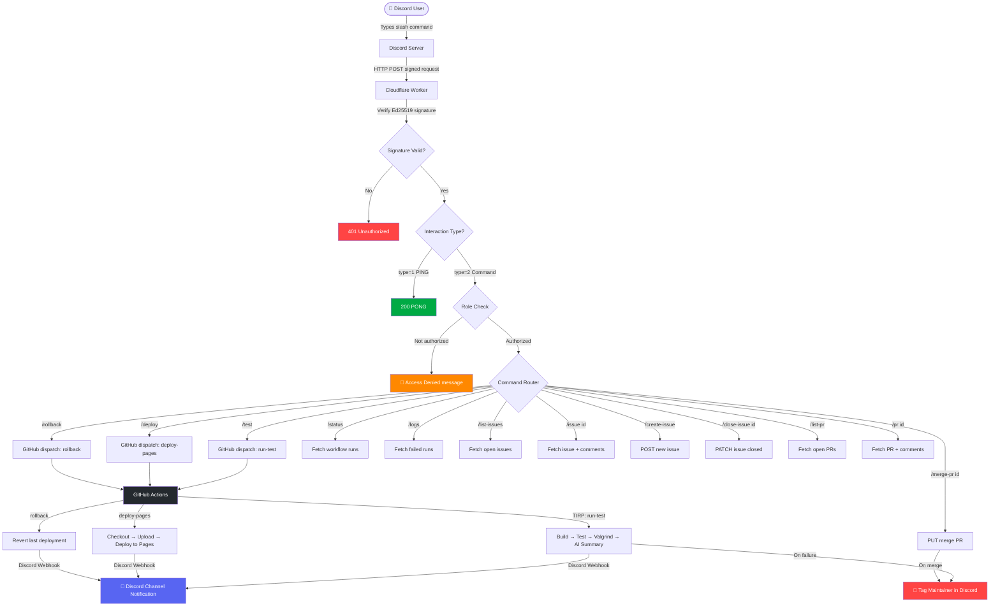

# Discord Bot + Cloudflare Worker + GitHub Actions Setup

---

## System Architecture



---

## Overview

This document covers the complete setup for a serverless Discord bot that:

- Receives slash commands via Cloudflare Workers
- Enforces role-based access control (Maintainer / Developer roles)
- Triggers GitHub Actions workflows via the GitHub API
- Reads and manages issues and pull requests from your repository
- Tags maintainers on CI/CD failures
- Sends rich workflow result notifications back to Discord via webhook

The system has four layers:

```
Discord Slash Command
        |
Cloudflare Worker  (receives, verifies signature, checks roles, routes)
        |
GitHub REST API    (triggers workflows, reads/writes issues and PRs)
        |
GitHub Actions     (runs TIRP, deploys pages, rollback)
        |
Discord Webhook    (sends results and failure alerts back to channel)
```

---

## Understanding the TIRP Protocol

**TIRP — Test Init Response Protocol** is the name of the primary CI workflow in this repository. The name describes exactly what it does: it initialises a test run and responds with a full diagnostic report.

### What TIRP Does

When triggered (either by a push, pull request, `/test` Discord command, or manually), TIRP runs the following sequence in order:

**1. Checkout**
Clones the repository at the triggering commit with full history so diff-based tooling works correctly.

**2. Print trigger context**
Logs where the trigger came from — a push, a Discord command, a manual dispatch — along with the GitHub actor, branch, and any Discord payload fields (username, user ID, command name).

**3. Build and test** (`build_and_test.sh`)
Compiles the project and runs the CTest suite. Exit code is captured separately so later steps can still run even if this fails. Output is written to `build_and_test.log`.

**4. Valgrind test protocol** (`valgrind_tests.sh`)
Runs the test suite again under Valgrind to check for memory errors, leaks, and undefined behaviour. Output is written to `valgrind_tests.log`. This step always runs regardless of whether the build/test step passed.

**5. AI push summary** (push events only)
Sends the Git diff and commit metadata to the Groq API and generates a structured summary covering: what changed, probable intent, key code changes, and risks or follow-up items. Output is written to `ai_push_summary.txt`.

**6. Prepare Discord payloads**
A Python script parses all log files and assembles the Discord notification content. It extracts:
- Overall pass/fail status with emoji
- Repository, branch, actor, commit SHA, and run URL
- CTest statistics (total / passed / failed counts)
- Valgrind pass/fail
- Failure output blocks (up to 30 lines each) if either check failed
- The normalised AI summary split into 1600-character chunks for multi-message delivery

**7. Validate Discord webhook**
Checks that the `WEBHOOK` secret is set and is a valid Discord webhook URL before attempting to send. Skips notification silently if not configured.

**8. Send Discord notification**
Posts the main status message first, then sends each AI summary chunk with a 5-second delay between messages to avoid Discord rate limits.

**9. Mark workflow failed**
After all notifications are sent, the workflow exits with a non-zero code if either the build/test or Valgrind step failed. This ensures GitHub marks the run as failed and blocks merges if branch protection is enabled.

### TIRP Trigger Sources

| Source | How it triggers |
|---|---|
| `git push` | Automatically on every push to any branch |
| Pull request | On PRs targeting `main` or `master` |
| `/test` Discord command | Via `repository_dispatch` event type `run-test` |
| GitHub UI | Via `workflow_dispatch` with optional trigger source label |

### TIRP Notification Format

A typical Discord notification from TIRP looks like this:

```
✅ TEST INIT RESPONSE PROTOCOL SUCCESS

Repository: `Jayesh-Dev21/GB_Emulator`
Branch: `main`
Actor: `jayesh`
Head Commit: `a1b2c3d`
Run: #42

Checks
- Tests: `PASS` | total=`12` passed=`12` failed=`0`
- Valgrind: `PASS`
- Commit Count In Push: `3`

Commits:
- `a1b2c3d` Fix memory leak in CPU step (jayesh)
- `b2c3d4e` Add timer interrupt handler (jayesh)
- `c3d4e5f` Update README (jayesh)
```

Followed by one or more AI summary messages:

```
AI Commit Summary (1/1)

**Push Summary**
Three commits addressing a memory leak in the CPU step function,
a new timer interrupt handler, and documentation updates.

**Key Changes**
- Fixed use-after-free in cpu_step by deferring buffer release
- Added IRQ handler registration for timer channel 2
- Updated README with build instructions

**Risks / Follow-ups**
- Timer handler not yet tested under Valgrind
- Buffer fix should be reviewed against similar patterns in ppu.c
```

---

## Part 1 — Discord Application Setup

### 1.1 Create the Application

1. Go to https://discord.com/developers/applications
2. Click **New Application**, give it a name, and confirm.
3. On the left sidebar, go to **General Information**.
4. Copy and save:
   - **Application ID** — needed for registering commands
   - **Public Key** — store in Cloudflare as `DISCORD_PUBLIC_KEY`

### 1.2 Create a Bot User

1. On the left sidebar, go to **Bot**.
2. Click **Add Bot** and confirm.
3. Under **Token**, click **Reset Token**, copy and save it. This is used only for registering commands, not in the Worker itself.
4. Under **Privileged Gateway Intents**, nothing needs to be enabled for slash commands.

### 1.3 Invite the Bot to Your Server

1. On the left sidebar, go to **OAuth2 > URL Generator**.
2. Under **Scopes**, select `bot` and `applications.commands`.
3. Under **Bot Permissions**, select `Send Messages`.
4. Copy the generated URL and open it in a browser, then select your server.

### 1.4 Get Your Role IDs

Role IDs are required for the access control system.

1. In Discord, go to **User Settings → Advanced** and enable **Developer Mode**.
2. Go to your server → **Server Settings → Roles**.
3. Right-click the **Maintainer** role → **Copy Role ID**.
4. Repeat for the **Developer** role.
5. Save both IDs — they will be stored as `ALLOWED_ROLE_IDS` in Cloudflare.

### 1.5 Get the Maintainer's Discord User ID

1. Right-click the maintainer user in Discord.
2. Click **Copy User ID**.
3. Save it — it will be stored as `MAINTAINER_ID` in Cloudflare.

### 1.6 Register Slash Commands

Replace `YOUR_APP_ID` and `YOUR_BOT_TOKEN` below, then run the curl command.

```bash
curl -X PUT \
  "https://discord.com/api/v10/applications/YOUR_APP_ID/commands" \
  -H "Authorization: Bot YOUR_BOT_TOKEN" \
  -H "Content-Type: application/json" \
  -d '[
    {
      "name": "test",
      "description": "Trigger the CI test workflow (TIRP)"
    },
    {
      "name": "deploy",
      "description": "Deploy to GitHub Pages"
    },
    {
      "name": "rollback",
      "description": "Rollback the last deployment"
    },
    {
      "name": "status",
      "description": "Show recent workflow run statuses"
    },
    {
      "name": "logs",
      "description": "Show recent failed workflow runs"
    },
    {
      "name": "list-issues",
      "description": "List open issues in the repository"
    },
    {
      "name": "issue",
      "description": "Get details for a specific issue",
      "options": [
        {
          "name": "id",
          "type": 4,
          "description": "Issue number",
          "required": true
        }
      ]
    },
    {
      "name": "create-issue",
      "description": "Create a new GitHub issue",
      "options": [
        {
          "name": "title",
          "type": 3,
          "description": "Issue title",
          "required": true
        },
        {
          "name": "body",
          "type": 3,
          "description": "Issue description",
          "required": false
        }
      ]
    },
    {
      "name": "close-issue",
      "description": "Close a GitHub issue",
      "options": [
        {
          "name": "id",
          "type": 4,
          "description": "Issue number",
          "required": true
        }
      ]
    },
    {
      "name": "list-pr",
      "description": "List open pull requests"
    },
    {
      "name": "pr",
      "description": "Get details for a specific pull request",
      "options": [
        {
          "name": "id",
          "type": 4,
          "description": "Pull request number",
          "required": true
        }
      ]
    },
    {
      "name": "merge-pr",
      "description": "Merge a pull request",
      "options": [
        {
          "name": "id",
          "type": 4,
          "description": "Pull request number",
          "required": true
        }
      ]
    },
    {
      "name": "help",
      "description": "Show all available commands"
    }
  ]'
```

> **Important — avoid duplicate commands:** Do NOT register commands both globally and guild-scoped — this causes every command to appear twice in Discord. Use guild-scoped only during development (instant propagation), and switch to global only when ready for production.

### 1.7 Clearing Duplicate Commands

If commands are already showing twice, wipe both scopes and re-register guild-scoped only:

```bash
# Step 1 — Wipe global commands
curl -X PUT \
  "https://discord.com/api/v10/applications/YOUR_APP_ID/commands" \
  -H "Authorization: Bot YOUR_BOT_TOKEN" \
  -H "Content-Type: application/json" \
  -d '[]'

# Step 2 — Wipe guild commands
curl -X PUT \
  "https://discord.com/api/v10/applications/YOUR_APP_ID/guilds/YOUR_GUILD_ID/commands" \
  -H "Authorization: Bot YOUR_BOT_TOKEN" \
  -H "Content-Type: application/json" \
  -d '[]'
```

Wait ~1 minute for Discord to propagate the wipe, then re-run the bulk register command above using the guild-scoped URL:
`https://discord.com/api/v10/applications/YOUR_APP_ID/guilds/YOUR_GUILD_ID/commands`

Your guild ID is your server ID — right-click your server name in Discord with Developer Mode enabled → **Copy Server ID**.

---

## Part 2 — GitHub Token Setup

> ⚠️ **Security warning:** Never paste your GitHub token in a terminal, chat message, document, or anywhere it could be seen or logged. If a token is ever accidentally exposed, revoke it immediately at https://github.com/settings/tokens before doing anything else. A compromised token gives full API access to your repository.

### 2.1 Verify Your Token Has the Right Permissions

The most common cause of `/test` triggering the bot reply but no workflow running is a token that is missing **Actions: Read and write**. You can verify with:

```bash
curl -X POST \
  "https://api.github.com/repos/Jayesh-Dev21/GB_Emulator/dispatches" \
  -H "Authorization: Bearer YOUR_GITHUB_TOKEN" \
  -H "Content-Type: application/json" \
  -H "Accept: application/vnd.github+json" \
  -d '{"event_type": "run-test", "client_payload": {"triggered_by": "manual_test"}}'
```

Expected response: **HTTP 204 with empty body** = success, workflow will appear in Actions tab within seconds.

If you get `403 Resource not accessible by personal access token` — your token is missing the Actions permission. Revoke it and generate a new one following the steps below.

### 2.2 Create a Fine-Grained Personal Access Token

1. Go to https://github.com/settings/tokens?type=beta
2. Click **Generate new token (fine-grained)**.
3. Set:
   - **Token name**: `discord-worker-bot`
   - **Expiration**: 90 days or as needed
   - **Repository access**: select only `Jayesh-Dev21/GB_Emulator`
4. Under **Repository permissions**, set **exactly** these — missing any will cause 403 errors:

| Permission | Level | Required for |
|---|---|---|
| **Actions** | **Read and write** | `/test`, `/deploy`, `/rollback`, `/status`, `/logs` |
| **Contents** | **Read-only** | `repository_dispatch` — without this the dispatch returns 403 |
| **Issues** | Read and write | `/issue`, `/list-issues`, `/create-issue`, `/close-issue` |
| **Pull requests** | Read and write | `/pr`, `/list-pr`, `/merge-pr` |
| **Metadata** | Read-only | Mandatory, auto-selected |

5. Click **Generate token** and copy it immediately — you cannot see it again.

### 2.3 Update the Token in Cloudflare

```bash
npx wrangler secret put WORKER --name gb-bot-v01
# paste the new token when prompted
```

Verify it saved:
```bash
npx wrangler secret list --name gb-bot-v01
```

---

## Part 3 — Cloudflare Worker Setup

### 3.1 Create the Worker

1. Go to https://dash.cloudflare.com
2. Go to **Workers & Pages → Create application → Create Worker**.
3. Name it (e.g. `gb-bot-v01`) and click **Deploy**.
4. Click **Edit code**, replace the default script with the code in **Part 4**, and click **Deploy**.

### 3.2 Set Secrets via Wrangler CLI

Run each command and paste the value when prompted:

```bash
# Your Discord app public key (64 hex chars from Discord Dev Portal → General Information)
npx wrangler secret put DISCORD_PUBLIC_KEY --name gb-bot-v01

# Your GitHub fine-grained personal access token (plain text)
npx wrangler secret put WORKER --name gb-bot-v01

# Your GitHub repo in owner/repo format
npx wrangler secret put GITHUB_REPO --name gb-bot-v01
# e.g.: Jayesh-Dev21/GB_Emulator

# Comma-separated Discord role IDs allowed to run restricted commands
npx wrangler secret put ALLOWED_ROLE_IDS --name gb-bot-v01
# e.g.: 123456789012345678,987654321098765432

# Discord user ID of the maintainer to tag on failures
npx wrangler secret put MAINTAINER_ID --name gb-bot-v01
# e.g.: 123456789012345678
```

Confirm all secrets are saved:

```bash
npx wrangler secret list --name gb-bot-v01
```

Expected output:

```json
[
  { "name": "DISCORD_PUBLIC_KEY", "type": "secret_text" },
  { "name": "WORKER",             "type": "secret_text" },
  { "name": "GITHUB_REPO",        "type": "secret_text" },
  { "name": "ALLOWED_ROLE_IDS",   "type": "secret_text" },
  { "name": "MAINTAINER_ID",      "type": "secret_text" }
]
```

### 3.3 Set the Interactions Endpoint in Discord

1. Go to https://discord.com/developers/applications → your app → **General Information**.
2. Under **Interactions Endpoint URL**, paste your Worker URL:
   `https://gb-bot-v01.jayeshkpuri.workers.dev`
3. Click **Save Changes**. Discord sends a signed PING — the Worker responds with PONG automatically.

---

## Part 4 — Cloudflare Worker Code

```javascript
// ── Config ───────────────────────────────────────────────────────────────────
// Secrets required in Cloudflare:
//   DISCORD_PUBLIC_KEY  — from Discord Dev Portal → General Information
//   WORKER             — GitHub fine-grained personal access token
//   GITHUB_REPO        — e.g. "Jayesh-Dev21/GB_Emulator"
//   ALLOWED_ROLE_IDS   — comma-separated Discord role IDs e.g. "111,222"
//   MAINTAINER_ID      — Discord user ID of the maintainer to tag on failure

export default {
  async fetch(request, env, ctx) {
    if (request.method !== "POST") {
      return new Response("Method not allowed", { status: 405 });
    }

    const signature = request.headers.get("x-signature-ed25519");
    const timestamp  = request.headers.get("x-signature-timestamp");

    if (!signature || !timestamp) {
      return new Response("Missing signature headers", { status: 401 });
    }

    const body = await request.text();

    const isValid = await verifyDiscordRequest(body, signature, timestamp, env.DISCORD_PUBLIC_KEY);
    if (!isValid) {
      return new Response("Invalid request signature", { status: 401 });
    }

    const json = JSON.parse(body);

    if (json.type === 1) {
      return new Response(JSON.stringify({ type: 1 }), {
        status: 200,
        headers: { "Content-Type": "application/json" }
      });
    }

    if (json.type !== 2) {
      return new Response("Unsupported interaction type", { status: 400 });
    }

    const command = json.data.name;
    const user = getUser(json);
    const userMention = `<@${user.id}>`;

    // Commands that require Maintainer or Developer role
    const RESTRICTED = ["test", "deploy", "rollback", "status", "logs", "issue",
                        "close-issue", "list-pr", "pr", "merge-pr"];

    if (RESTRICTED.includes(command)) {
      if (!hasAllowedRole(json, env)) {
        return reply(
          `🚫 **Access Denied**\n` +
          `${userMention} you don't have permission to run \`/${command}\`.\n` +
          `Required roles: **Maintainer** or **Developer**.`
        );
      }
    }

    switch (command) {
      case "test":
        ctx.waitUntil(triggerGitHub(env, json, "run-test", user));
        return reply(
          `🧪 **CI Test Triggered (TIRP)**\n` +
          `Triggered by ${userMention}\n` +
          `⏳ Running TIRP on \`${env.GITHUB_REPO}\`... Results will be posted here shortly.`
        );

      case "deploy":
        ctx.waitUntil(triggerGitHub(env, json, "deploy-pages", user));
        return reply(
          `🚀 **Deploy Triggered**\n` +
          `Triggered by ${userMention}\n` +
          `⏳ Deploying \`${env.GITHUB_REPO}\` to GitHub Pages...`
        );

      case "rollback":
        ctx.waitUntil(triggerGitHub(env, json, "rollback", user));
        return reply(
          `⏪ **Rollback Triggered**\n` +
          `Triggered by ${userMention}\n` +
          `⏳ Rolling back last deployment on \`${env.GITHUB_REPO}\`...`
        );

      case "status":
        return reply(await getWorkflowStatus(env));

      case "logs":
        return reply(await getWorkflowLogs(env));

      case "list-issues":
        return reply(await listIssues(env));

      case "issue":
        return reply(await getIssue(env, json));

      case "create-issue":
        return reply(await createIssue(env, json, user));

      case "close-issue":
        return reply(await closeIssue(env, json, user));

      case "list-pr":
        return reply(await listPRs(env));

      case "pr":
        return reply(await getPR(env, json));

      case "merge-pr":
        return reply(await mergePR(env, json, user));

      case "help":
        return reply(helpMessage());

      default:
        return reply(`❓ Unknown command: \`/${command}\`. Try \`/help\` for available commands.`);
    }
  }
};

// ── Role check ────────────────────────────────────────────────────────────────

function hasAllowedRole(json, env) {
  const memberRoles = json.member?.roles ?? [];
  const allowedRoles = (env.ALLOWED_ROLE_IDS ?? "").split(",").map(r => r.trim()).filter(Boolean);
  if (!allowedRoles.length) return true; // no roles configured = allow all
  return memberRoles.some(role => allowedRoles.includes(role));
}

function getUser(json) {
  return {
    id: json.member?.user?.id ?? json.user?.id ?? "0",
    username: json.member?.user?.username ?? json.user?.username ?? "unknown"
  };
}

// ── GitHub CI/CD ──────────────────────────────────────────────────────────────

async function triggerGitHub(env, interaction, eventType, user) {
  const res = await fetch(
    `https://api.github.com/repos/${env.GITHUB_REPO}/dispatches`,
    {
      method: "POST",
      headers: {
        Authorization: `Bearer ${env.WORKER}`,
        "Content-Type": "application/json",
        Accept: "application/vnd.github+json",
        "User-Agent": "discord-worker-bot"
      },
      body: JSON.stringify({
        event_type: eventType,
        client_payload: {
          triggered_by: "discord",
          user: user.username,
          user_id: user.id,
          command: interaction.data.name
        }
      })
    }
  );

  if (!res.ok) {
    const text = await res.text();
    const maintainerMention = env.MAINTAINER_ID ? `<@${env.MAINTAINER_ID}>` : "maintainer";
    console.error(
      `GitHub dispatch failed: ${res.status} ${text}\n` +
      `NOTIFY: ${maintainerMention} — dispatch failed for ${eventType} triggered by <@${user.id}>`
    );
  }
}

async function getWorkflowStatus(env) {
  const res = await fetch(
    `https://api.github.com/repos/${env.GITHUB_REPO}/actions/runs?per_page=5`,
    { headers: ghHeaders(env) }
  );

  if (!res.ok) return `❌ Failed to fetch workflow status: ${res.status}`;

  const data = await res.json();
  const runs = data.workflow_runs;
  if (!runs?.length) return "No recent workflow runs found.";

  const emoji = s => ({ completed: "✅", in_progress: "🔄", queued: "⏳",
                         failure: "❌", success: "✅", cancelled: "🚫" }[s] ?? "❓");

  let msg = `**🔧 Recent Workflow Runs — \`${env.GITHUB_REPO}\`**\n\n`;
  runs.forEach(r => {
    const conclusion = r.conclusion ?? r.status;
    msg += `${emoji(conclusion)} \`${r.name}\` — **${conclusion}**\n`;
    msg += `   Branch: \`${r.head_branch}\` | Triggered by: \`${r.event}\`\n`;
    msg += `   🔗 ${r.html_url}\n\n`;
  });

  return msg.slice(0, 1900);
}

async function getWorkflowLogs(env) {
  const res = await fetch(
    `https://api.github.com/repos/${env.GITHUB_REPO}/actions/runs?per_page=3&status=failure`,
    { headers: ghHeaders(env) }
  );

  if (!res.ok) return `❌ Failed to fetch logs: ${res.status}`;

  const data = await res.json();
  const runs = data.workflow_runs;
  if (!runs?.length) return "✅ No failed workflow runs found.";

  let msg = `**❌ Recent Failed Runs — \`${env.GITHUB_REPO}\`**\n\n`;
  runs.forEach(r => {
    msg += `❌ \`${r.name}\` on \`${r.head_branch}\`\n`;
    msg += `   Commit: \`${r.head_sha?.slice(0, 7)}\` by \`${r.head_commit?.author?.name ?? "unknown"}\`\n`;
    msg += `   🔗 ${r.html_url}\n\n`;
  });

  if (env.MAINTAINER_ID) {
    msg += `<@${env.MAINTAINER_ID}> please review the above failures.`;
  }

  return msg.slice(0, 1900);
}

// ── Issues ────────────────────────────────────────────────────────────────────

async function listIssues(env) {
  const res = await fetch(
    `https://api.github.com/repos/${env.GITHUB_REPO}/issues?state=open&per_page=10`,
    { headers: ghHeaders(env) }
  );
  if (!res.ok) return `❌ Failed to fetch issues: ${res.status}`;
  const issues = await res.json();
  const filtered = issues.filter(i => !i.pull_request);
  if (!filtered.length) return "✅ No open issues found.";

  let msg = `**📋 Open Issues — \`${env.GITHUB_REPO}\`**\n\n`;
  filtered.forEach(i => {
    msg += `\`#${i.number}\` **${i.title}**\n`;
    msg += `   👤 ${i.user?.login} | 🏷️ ${i.labels?.map(l => l.name).join(", ") || "none"}\n`;
    msg += `   🔗 ${i.html_url}\n\n`;
  });
  return msg.slice(0, 1900);
}

async function getIssue(env, json) {
  const id = json.data.options?.[0]?.value;
  if (!id) return "❌ No issue ID provided.";

  const [issueRes, commentsRes] = await Promise.all([
    fetch(`https://api.github.com/repos/${env.GITHUB_REPO}/issues/${id}`, { headers: ghHeaders(env) }),
    fetch(`https://api.github.com/repos/${env.GITHUB_REPO}/issues/${id}/comments?per_page=5`, { headers: ghHeaders(env) })
  ]);

  if (!issueRes.ok) return `❌ Issue #${id} not found (${issueRes.status}).`;
  const issue = await issueRes.json();
  const comments = commentsRes.ok ? await commentsRes.json() : [];
  const labels = issue.labels?.map(l => l.name).join(", ") || "none";
  const body = (issue.body || "No description.").slice(0, 300);

  let msg = `**📌 Issue #${issue.number} — ${issue.title}**\n`;
  msg += `State: \`${issue.state}\` | Author: \`${issue.user?.login}\` | Labels: \`${labels}\`\n`;
  msg += `🔗 ${issue.html_url}\n\n`;
  msg += body + (issue.body?.length > 300 ? "..." : "");

  if (comments.length) {
    msg += `\n\n**💬 Comments (${comments.length} shown):**\n`;
    comments.slice(0, 3).forEach(c => {
      const excerpt = (c.body || "").slice(0, 100);
      msg += `\n\`${c.user.login}\`: ${excerpt}` + (c.body?.length > 100 ? "..." : "");
    });
  }
  return msg.slice(0, 1900);
}

async function createIssue(env, json, user) {
  const title = json.data.options?.find(o => o.name === "title")?.value;
  const body  = json.data.options?.find(o => o.name === "body")?.value ?? "";
  if (!title) return "❌ No title provided.";

  const res = await fetch(
    `https://api.github.com/repos/${env.GITHUB_REPO}/issues`,
    {
      method: "POST",
      headers: ghHeaders(env),
      body: JSON.stringify({
        title,
        body: `${body}\n\n---\n_Reported via Discord by @${user.username}_`
      })
    }
  );

  if (!res.ok) return `❌ Failed to create issue: ${res.status}`;
  const issue = await res.json();
  return `✅ **Issue Created!**\n\`#${issue.number}\` — ${issue.title}\n🔗 ${issue.html_url}`;
}

async function closeIssue(env, json, user) {
  const id = json.data.options?.[0]?.value;
  if (!id) return "❌ No issue ID provided.";

  const res = await fetch(
    `https://api.github.com/repos/${env.GITHUB_REPO}/issues/${id}`,
    {
      method: "PATCH",
      headers: ghHeaders(env),
      body: JSON.stringify({ state: "closed" })
    }
  );

  if (!res.ok) return `❌ Failed to close issue #${id}: ${res.status}`;
  return `✅ Issue **#${id}** closed by <@${user.id}>.`;
}

// ── Pull Requests ─────────────────────────────────────────────────────────────

async function listPRs(env) {
  const res = await fetch(
    `https://api.github.com/repos/${env.GITHUB_REPO}/pulls?state=open&per_page=10`,
    { headers: ghHeaders(env) }
  );
  if (!res.ok) return `❌ Failed to fetch pull requests: ${res.status}`;
  const prs = await res.json();
  if (!prs.length) return "✅ No open pull requests found.";

  let msg = `**🔀 Open Pull Requests — \`${env.GITHUB_REPO}\`**\n\n`;
  prs.forEach(pr => {
    msg += `\`#${pr.number}\` **${pr.title}**\n`;
    msg += `   \`${pr.head.ref}\` → \`${pr.base.ref}\` | 👤 ${pr.user?.login}\n`;
    msg += `   🔗 ${pr.html_url}\n\n`;
  });
  return msg.slice(0, 1900);
}

async function getPR(env, json) {
  const id = json.data.options?.[0]?.value;
  if (!id) return "❌ No PR ID provided.";

  const [prRes, commentsRes] = await Promise.all([
    fetch(`https://api.github.com/repos/${env.GITHUB_REPO}/pulls/${id}`, { headers: ghHeaders(env) }),
    fetch(`https://api.github.com/repos/${env.GITHUB_REPO}/issues/${id}/comments?per_page=5`, { headers: ghHeaders(env) })
  ]);

  if (!prRes.ok) return `❌ PR #${id} not found (${prRes.status}).`;
  const pr = await prRes.json();
  const comments = commentsRes.ok ? await commentsRes.json() : [];
  const labels = pr.labels?.map(l => l.name).join(", ") || "none";
  const body = (pr.body || "No description.").slice(0, 300);
  const mergeable = pr.mergeable === null ? "unknown" : pr.mergeable ? "✅ yes" : "❌ no";

  let msg = `**🔀 PR #${pr.number} — ${pr.title}**\n`;
  msg += `\`${pr.head.ref}\` → \`${pr.base.ref}\` | State: \`${pr.state}\`\n`;
  msg += `Author: \`${pr.user?.login}\` | Labels: \`${labels}\` | Mergeable: ${mergeable}\n`;
  msg += `Commits: \`${pr.commits}\` | +${pr.additions} / -${pr.deletions}\n`;
  msg += `🔗 ${pr.html_url}\n\n`;
  msg += body + (pr.body?.length > 300 ? "..." : "");

  if (comments.length) {
    msg += `\n\n**💬 Comments:**\n`;
    comments.slice(0, 3).forEach(c => {
      const excerpt = (c.body || "").slice(0, 100);
      msg += `\n\`${c.user.login}\`: ${excerpt}` + (c.body?.length > 100 ? "..." : "");
    });
  }
  return msg.slice(0, 1900);
}

async function mergePR(env, json, user) {
  const id = json.data.options?.[0]?.value;
  if (!id) return "❌ No PR ID provided.";

  const res = await fetch(
    `https://api.github.com/repos/${env.GITHUB_REPO}/pulls/${id}/merge`,
    {
      method: "PUT",
      headers: ghHeaders(env),
      body: JSON.stringify({
        commit_message: `Merged via Discord by @${user.username}`
      })
    }
  );

  if (res.status === 405) return `❌ PR #${id} is not mergeable.`;
  if (res.status === 409) return `❌ PR #${id} has a merge conflict.`;
  if (!res.ok) return `❌ Failed to merge PR #${id}: ${res.status}`;

  return (
    `✅ **PR #${id} Merged!**\n` +
    `Merged by <@${user.id}>\n` +
    (env.MAINTAINER_ID ? `\n<@${env.MAINTAINER_ID}> FYI — PR #${id} was merged by <@${user.id}>` : "")
  );
}

// ── Help ──────────────────────────────────────────────────────────────────────

function helpMessage() {
  return `**🤖 GB_Bot — Available Commands**

**🔒 Restricted (Maintainer / Developer role required)**
\`/test\` — Trigger CI test workflow (TIRP)
\`/deploy\` — Deploy to GitHub Pages
\`/rollback\` — Rollback last deployment
\`/status\` — View recent workflow runs
\`/logs\` — View recent failed runs + tag maintainer
\`/issue [id]\` — Get issue details and comments
\`/close-issue [id]\` — Close an issue
\`/list-pr\` — List open pull requests
\`/pr [id]\` — Get PR details and comments
\`/merge-pr [id]\` — Merge a pull request

**🌐 Open to all members**
\`/list-issues\` — List open issues
\`/create-issue\` — Create a new GitHub issue
\`/help\` — Show this message`;
}

// ── Discord Ed25519 verification ──────────────────────────────────────────────

async function verifyDiscordRequest(body, signature, timestamp, publicKey) {
  try {
    const key = await crypto.subtle.importKey(
      "raw",
      hexToBytes(publicKey),
      { name: "Ed25519", namedCurve: "Ed25519" },
      false,
      ["verify"]
    );
    const message = new TextEncoder().encode(timestamp + body);
    return await crypto.subtle.verify({ name: "Ed25519" }, key, hexToBytes(signature), message);
  } catch (e) {
    console.error("Signature verify error:", e.message);
    return false;
  }
}

function hexToBytes(hex) {
  const bytes = new Uint8Array(hex.length / 2);
  for (let i = 0; i < hex.length; i += 2) {
    bytes[i / 2] = parseInt(hex.slice(i, i + 2), 16);
  }
  return bytes;
}

// ── Shared helpers ────────────────────────────────────────────────────────────

function ghHeaders(env) {
  return {
    Authorization: `Bearer ${env.WORKER}`,
    Accept: "application/vnd.github+json",
    "Content-Type": "application/json",
    "User-Agent": "discord-worker-bot"
  };
}

function reply(content) {
  return new Response(JSON.stringify({ type: 4, data: { content: String(content) } }), {
    status: 200,
    headers: { "Content-Type": "application/json" }
  });
}
```

---

## Part 5 — GitHub Workflows

### 5.1 Test Workflow (TIRP)

Save as `.github/workflows/test-init-response-protocol.yml`:

```yaml
name: TEST INIT RESPONSE PROTOCOL

on:
  push:
  pull_request:
    branches: ["main", "master"]

  workflow_dispatch:
    inputs:
      trigger_source:
        description: "Trigger source (discord, manual, etc.)"
        required: false
        default: "manual"

  repository_dispatch:
    types: [run-test]

permissions:
  contents: read

concurrency:
  group: test-init-response-${{ github.ref }}
  cancel-in-progress: true

jobs:
  test-init-response:
    name: Build, Test, Valgrind, Discord Notify
    runs-on: ubuntu-latest
    timeout-minutes: 60

    steps:
      - name: Checkout
        uses: actions/checkout@v4
        with:
          persist-credentials: false
          fetch-depth: 0

      - name: Print trigger context
        run: |
          echo "Event: ${{ github.event_name }}"
          echo "Trigger source: ${{ github.event.inputs.trigger_source }}"
          echo "Client payload: ${{ toJson(github.event.client_payload) }}"

      - name: Build and run tests
        id: run_build_test
        run: |
          set +e
          chmod +x ./utility_scripts/build_and_test.sh
          ./utility_scripts/build_and_test.sh > build_and_test.log 2>&1
          code=$?
          echo "exit_code=$code" >> "$GITHUB_OUTPUT"
          exit 0

      - name: Run valgrind test protocol
        id: run_valgrind
        if: always()
        run: |
          set +e
          chmod +x ./utility_scripts/valgrind_tests.sh
          sudo ./utility_scripts/valgrind_tests.sh > valgrind_tests.log 2>&1
          code=$?
          echo "exit_code=$code" >> "$GITHUB_OUTPUT"
          exit 0

      - name: Generate AI push summary
        if: always() && github.event_name == 'push'
        env:
          GROQ_API_KEY: ${{ secrets.API }}
          GROQ_MODEL: openai/gpt-oss-20b
          EVENT_PATH: ${{ github.event_path }}
          REPO: ${{ github.repository }}
          REF_NAME: ${{ github.ref_name }}
        run: |
          python3 -m pip install --upgrade pip
          python3 -m pip install openai
          chmod +x ./utility_scripts/groq_push_summary.py
          python3 ./utility_scripts/groq_push_summary.py

      - name: Ensure AI summary file exists
        if: always()
        run: |
          [ -f ai_push_summary.txt ] || echo "AI summary was not generated" > ai_push_summary.txt

      - name: Prepare Discord payloads
        if: always()
        env:
          JOB_STATUS: ${{ job.status }}
          RUN_ID: ${{ github.run_id }}
          RUN_NUMBER: ${{ github.run_number }}
          REPO: ${{ github.repository }}
          REF_NAME: ${{ github.ref_name }}
          SHA: ${{ github.sha }}
          ACTOR: ${{ github.actor }}
          BUILD_TEST_EXIT: ${{ steps.run_build_test.outputs.exit_code }}
          VALGRIND_EXIT: ${{ steps.run_valgrind.outputs.exit_code }}
          EVENT_PATH: ${{ github.event_path }}
          SERVER_URL: ${{ github.server_url }}
        run: |
          python3 - <<'PY'
          # (full Python payload script — see original workflow for complete implementation)
          # This script parses build_and_test.log and valgrind_tests.log,
          # assembles Discord message payloads, and writes them to disk.
          PY

      - name: Validate Discord webhook
        id: webhook_check
        if: always() && github.event_name == 'push'
        env:
          WEBHOOK: ${{ secrets.WEBHOOK }}
        run: |
          if [ -z "$WEBHOOK" ]; then
            echo "should_send=false" >> "$GITHUB_OUTPUT"
            exit 0
          fi
          case "$WEBHOOK" in
            https://discord.com/api/webhooks/*|https://ptb.discord.com/api/webhooks/*)
              echo "should_send=true" >> "$GITHUB_OUTPUT" ;;
            *)
              echo "should_send=false" >> "$GITHUB_OUTPUT" ;;
          esac

      - name: Send Discord notification messages
        if: always() && github.event_name == 'push' && steps.webhook_check.outputs.should_send == 'true'
        env:
          WEBHOOK: ${{ secrets.WEBHOOK }}
        run: |
          curl --fail --silent --show-error \
            -H "Content-Type: application/json" \
            -X POST --data @discord_payload_main.json "$WEBHOOK"

          if [ -f discord_ai_payloads.txt ]; then
            while IFS= read -r payload_file; do
              [ -n "$payload_file" ] || continue
              sleep 5
              curl --fail --silent --show-error \
                -H "Content-Type: application/json" \
                -X POST --data @"$payload_file" "$WEBHOOK"
            done < discord_ai_payloads.txt
          fi

      - name: Mark workflow failed if checks failed
        if: always()
        run: |
          if [ "${{ steps.run_build_test.outputs.exit_code }}" != "0" ] || \
             [ "${{ steps.run_valgrind.outputs.exit_code }}" != "0" ]; then
            echo "One or more test protocols failed"
            exit 1
          fi
```

### 5.2 Deploy Workflow

Save as `.github/workflows/deploy.yml`:

```yaml
name: Deploy static content to Pages

on:
  push:
    tags:
      - "deploy-*"

  workflow_dispatch:

  repository_dispatch:
    types: [deploy-pages]

permissions:
  contents: read
  pages: write
  id-token: write

concurrency:
  group: "pages"
  cancel-in-progress: false

jobs:
  deploy:
    environment:
      name: github-pages
      url: ${{ steps.deployment.outputs.page_url }}
    runs-on: ubuntu-latest

    steps:
      - name: Checkout
        uses: actions/checkout@v4

      - name: Print trigger context
        run: |
          echo "Event: ${{ github.event_name }}"
          echo "Client payload: ${{ toJson(github.event.client_payload) }}"

      - name: Setup Pages
        uses: actions/configure-pages@v5

      - name: Upload artifact
        uses: actions/upload-pages-artifact@v3
        with:
          path: './documentation/html'

      - name: Deploy to GitHub Pages
        id: deployment
        uses: actions/deploy-pages@v4
```

### 5.3 Rollback Workflow

Save as `.github/workflows/rollback.yml`:

```yaml
name: Rollback Deployment

on:
  workflow_dispatch:

  repository_dispatch:
    types: [rollback]

permissions:
  contents: read
  pages: write
  id-token: write

jobs:
  rollback:
    runs-on: ubuntu-latest

    steps:
      - name: Checkout
        uses: actions/checkout@v4
        with:
          fetch-depth: 0

      - name: Print trigger context
        run: |
          echo "Event: ${{ github.event_name }}"
          echo "Triggered by: ${{ github.event.client_payload.user }}"

      - name: Find previous successful deployment
        id: find_prev
        run: |
          PREV_SHA=$(git log --pretty=format:"%H" -n 2 | tail -1)
          echo "prev_sha=$PREV_SHA" >> "$GITHUB_OUTPUT"
          echo "Rolling back to: $PREV_SHA"

      - name: Checkout previous commit
        run: git checkout ${{ steps.find_prev.outputs.prev_sha }}

      - name: Setup Pages
        uses: actions/configure-pages@v5

      - name: Upload previous artifact
        uses: actions/upload-pages-artifact@v3
        with:
          path: './documentation/html'

      - name: Deploy previous version
        id: deployment
        uses: actions/deploy-pages@v4
```

---

## Part 6 — Secrets Reference

### GitHub Repository Secrets

Go to your repository → **Settings → Secrets and variables → Actions → New repository secret**.

| Secret | Value |
|---|---|
| `WEBHOOK` | Discord webhook URL for the notification channel |
| `API` | Your Groq API key for AI push summaries |

To create a Discord webhook: channel → **Edit Channel → Integrations → Webhooks → New Webhook** → Copy URL.

### Cloudflare Worker Secrets

| Secret | Value |
|---|---|
| `DISCORD_PUBLIC_KEY` | 64-char hex public key from Discord Dev Portal |
| `WORKER` | GitHub fine-grained personal access token |
| `GITHUB_REPO` | `owner/repo` e.g. `Jayesh-Dev21/GB_Emulator` |
| `ALLOWED_ROLE_IDS` | Comma-separated Discord role IDs e.g. `111,222` |
| `MAINTAINER_ID` | Discord user ID of the maintainer |

---

## Part 7 — Command Reference

### Restricted Commands (Maintainer / Developer role required)

| Command | What it does | Notifies maintainer? |
|---|---|---|
| `/test` | Triggers TIRP (CI build + test + Valgrind) | On failure via TIRP webhook |
| `/deploy` | Deploys to GitHub Pages | No |
| `/rollback` | Rolls back to previous deployment | No |
| `/status` | Shows last 5 workflow runs with status links | No |
| `/logs` | Shows recent failed runs and tags maintainer | Yes, always |
| `/issue [id]` | Shows issue details and comments | No |
| `/close-issue [id]` | Closes a GitHub issue | No |
| `/list-pr` | Lists all open pull requests | No |
| `/pr [id]` | Shows PR details, stats, and comments | No |
| `/merge-pr [id]` | Merges a PR, notifies maintainer | Yes, always |

### Open Commands (all members)

| Command | What it does |
|---|---|
| `/list-issues` | Lists open issues |
| `/create-issue` | Creates a new GitHub issue |
| `/help` | Shows the full command list |

---

## Part 8 — Verification Checklist

Work through this list in order before testing in Discord.

1. Worker is deployed and accessible at its URL.
2. All five Cloudflare secrets are set (`DISCORD_PUBLIC_KEY`, `WORKER`, `GITHUB_REPO`, `ALLOWED_ROLE_IDS`, `MAINTAINER_ID`).
3. The Interactions Endpoint URL in Discord Dev Portal points to the Worker URL and was saved successfully.
4. Slash commands registered **guild-scoped only** — not both global and guild (causes duplicates).
5. The bot is invited to the server with `bot` and `applications.commands` scopes.
6. All three workflow files are committed to the **`main` branch** (not a feature branch).
7. `WEBHOOK` and `API` secrets are set in the GitHub repository.
8. Maintainer and Developer roles exist in the Discord server and their IDs are in `ALLOWED_ROLE_IDS`.
9. GitHub token has **Actions: Read and write** confirmed via the curl test in Part 2.1 (must return HTTP 204).

---

## Part 9 — Testing

### Verify Worker is reachable

```bash
curl -X POST https://gb-bot-v01.jayeshkpuri.workers.dev \
  -H "Content-Type: application/json" \
  -H "x-signature-ed25519: $(python3 -c "print('a'*128)")" \
  -H "x-signature-timestamp: 1234567890" \
  -d '{"type":1}'
```

Expected: `Invalid request signature` with status 401. This confirms the Worker is live.

### Test a slash command

Type `/test` in your Discord server. You should see the TIRP acknowledgement message and within a few seconds the workflow should appear in the Actions tab.

### Test role restriction

Type `/deploy` as a user without the Maintainer or Developer role. You should see the access denied message with your mention.

### Test issue commands

Type `/list-issues` to verify the GitHub token has correct permissions.

---

## Part 10 — Common Errors

**401 on Discord endpoint save**
Signature verification is failing. Delete and re-set `DISCORD_PUBLIC_KEY` in Cloudflare using `npx wrangler secret put DISCORD_PUBLIC_KEY --name gb-bot-v01` and paste the exact 64-char hex key from Discord Dev Portal.

**403 from GitHub on workflow trigger (`Resource not accessible by personal access token`)**
Your token is missing a required permission. The two most common causes are: (1) missing **Actions: Read and write**, or (2) missing **Contents: Read-only** — both are required for `repository_dispatch` to work. This is what causes the bot to reply "CI test workflow triggered" but no workflow actually runs. Revoke the token at https://github.com/settings/tokens, generate a new one with Actions: Read and write AND Contents: Read-only enabled, and re-set it with `npx wrangler secret put WORKER --name gb-bot-v01`. Test with the curl command in Part 2.1 — you must see HTTP 204 before the Discord command will work.

**Bot replies but workflow never appears in Actions tab**
Two possible causes: (1) the token is missing Actions permission — see above. (2) the workflow file is not on the default branch (`main`). The `repository_dispatch` event only triggers workflows that exist on the default branch. Run `git log --oneline -- .github/workflows/test-init-response-protocol.yml` on `main` to confirm the file is there.

**Commands appear twice in Discord**
You registered commands both globally and guild-scoped. Wipe both using the curl commands in Part 1.7, wait 1 minute, then re-register using only the guild-scoped URL.

**Commands not appearing in Discord**
Global commands take up to one hour to propagate. Use guild-scoped registration during development for instant propagation.

**401 on Discord endpoint save**
Signature verification is failing. Delete and re-set `DISCORD_PUBLIC_KEY` in Cloudflare using `npx wrangler secret put DISCORD_PUBLIC_KEY --name gb-bot-v01` and paste the exact 64-char hex key from Discord Dev Portal.

**Access denied for all users including maintainer**
Check that `ALLOWED_ROLE_IDS` contains the correct role IDs. Role IDs are numeric strings — confirm with right-click → Copy Role ID in Discord with Developer Mode enabled.

**Merge-PR fails with 405**
The PR has unresolved review requests or branch protection rules blocking the merge. Resolve those in GitHub first.
